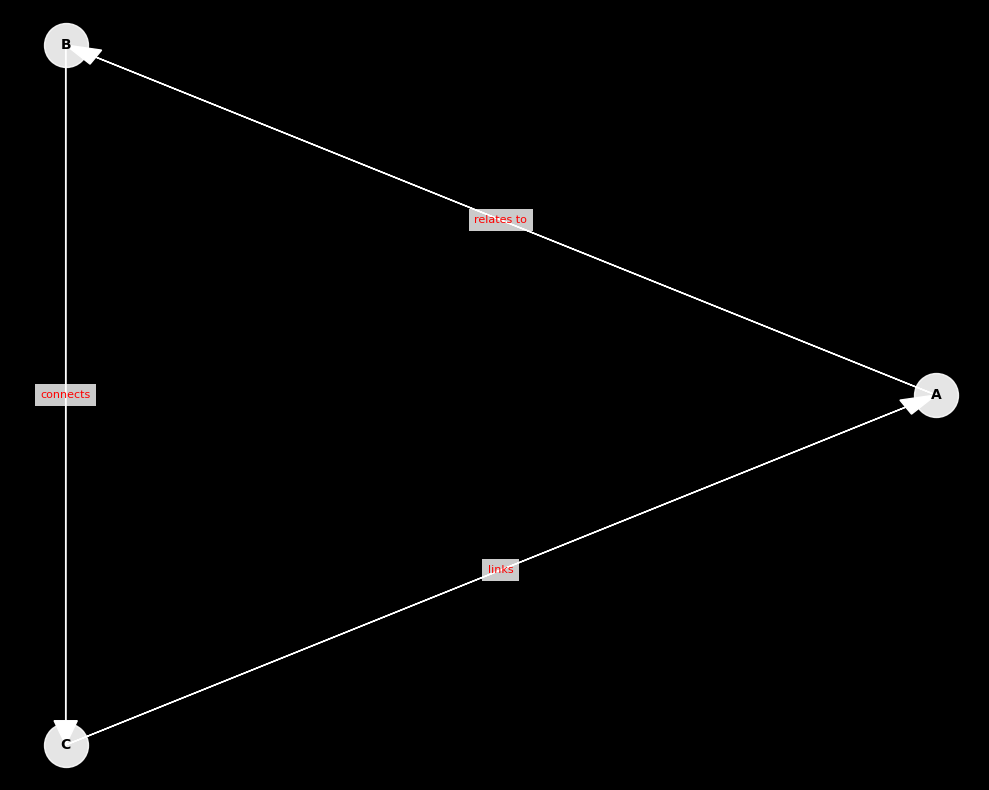

# Getting Started

## Installation

DeepVisual can be installed using pip:

```bash
pip install deepvisual
```

or local installation

```bash
pip install -e /path/deepvisual
```

## Basic Usage

### Duplet Link Visualization

Table should be sorted (you can sort by deeplinks library) in the format - first closed links, then links between closed links (they are defined as if they contain numbers that are in closed links), if there are no numbers that would be in closed links (in the example above it is 5:6), then it is a link between ID operations. The first thing we do is to draw closed links starting from the right, then from the left. Then we draw links between closed links and links between operations.
Duplet links show connections between pairs of nodes:

```python
import deepvisual as dv
import pandas as pd
import deeplinks as dl

# Create a sample dataframe with doublet relationships
data = {
    'from': [6, 4, 3, 2, 2, 2, 4, 1],
    'to': [5, 4, 3, 2, 1, 3, 2, 1]
}
df = pd.DataFrame(data)

# Let's sort using the deeplinks library
dl.sort_duoblet(df)

# The result is a sorted table:
# 'from': [1, 2, 3, 4, 2, 2, 4, 6]
# 'to': [1, 2, 3, 4, 1, 3, 2, 5]

# Create the visualization
visualize_link_doublet(df, 
                       loop_color='lightgray', # Hinge color
                       edge_color='white', # Arrow color
                       inter_edge_color='white', # Arrow_2 color
                       background_color='black', # Background color
                       title='links', # Name of the chart
                       color_title='white' # Color of the chart name
                      )
```


### Doublet Graph Visualization 

Doublet links are useful for showing complex relationships:

```python
import deepvisual as dv
import pandas as pd

# Create a sample dataframe with doublet relationships
data = {
    'from': [1, 2, 3, 4, 2, 2, 4, 6],
    'to': [1, 2, 3, 4, 1, 3, 2, 5]
}
df = pd.DataFrame(data)

# Create the visualization
visualize_doblet_graph(
    df,
    edge_color="white", # Arrow color
    node_text_color="white", # The color of the node labels
    background_color="black", # Background color
    figsize=(10, 8), # Graph size
    curvature=0.3, # Level of line curvature
    seed=42,
    loop_radius=0.6, # Loop radius
    arrow_style="->,head_length=0.7,head_width=0.5", # Arrow style (e.g. -> or -|> )
    connection_style="arc3",
    node_text_visible=True # Label designation (True or False)
)
```


### Triplet visualization by graph

A triplet graph shows relationships between three elements.
in it the first column accesses the third creating a link to the name of the second column. This is much clearer on the example of the Sub-Verb-Object transaction table.
Here's how to create one:

```python
import deepvisual as dv
import pandas as pd

# Create a sample dataframe with triplet relationships
df = pd.DataFrame({
    'source': ['A', 'B', 'C'],
    'relation': ['relates to', 'connects', 'links'],
    'target': ['B', 'C', 'A']
})

# Create the visualization
dv.visualize_triplet_graph(
    df, # Dataframe
    edge_color="blue", # Arrow color
    node_color="lightgreen", # Node color
    node_text_color="black", # The color of the node labels
    background_color="white", # Background color
    figsize=(10, 8), # Graph size
    title='', # Name of the chart
    color_title='black' # Color of the chart name
)
```



## Customization

All visualization functions support extensive customization:

- Colors for nodes, edges, text, and background
- Figure size and layout
- Edge styles and curvatures
- Node labels and text visibility
- Arrow styles and sizes

See the [API Reference](/api-reference) for complete details on all customization options.

## Best Practices

1. **Data Preparation**:
   - Ensure your data is in the correct format (DataFrame)
   - Clean and preprocess your data before visualization
   - Use meaningful labels for nodes and edges

2. **Visualization**:
   - Choose appropriate colors for good contrast
   - Use consistent styling across related visualizations
   - Consider the size and complexity of your graph

3. **Performance**:
   - For large graphs, consider simplifying the visualization
   - Use appropriate figure sizes for your data
   - Test different layouts for optimal readability 

